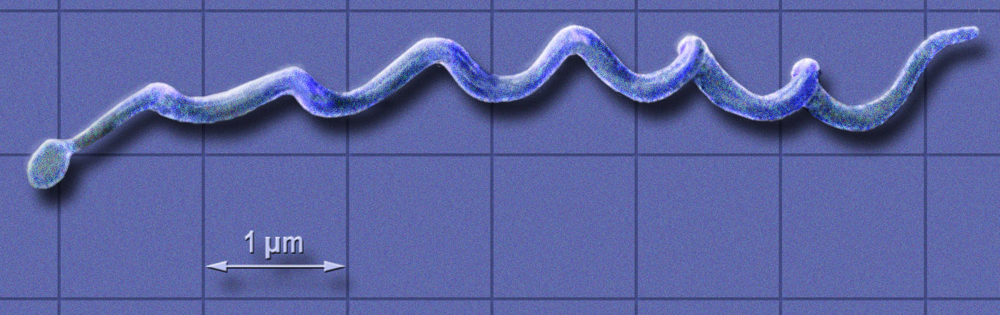

First, we need to load library we need for this assignment
```{r}
library(rentrez)
library(dplyr)
library(scales)
```

Import the Sequences.csv file.
```{r}
#import data through read.csv()
mydata <- read.csv("Sequences.csv")
```

Count the number of each base pair (A, T, C and G), in each of the three sequences. 
```{r}
#convert to characters
seq_1 <- as.character(mydata$Sequence[1])
seq_2 <- as.character(mydata$Sequence[2])
seq_3 <- as.character(mydata$Sequence[3])
```

```{r}
#count the number of each base pair
##sequence 1
count1_A <- nchar(gsub("[^A]", "", seq_1))
count1_T <- nchar(gsub("[^T]", "", seq_1))
count1_C <- nchar(gsub("[^C]", "", seq_1))
count1_G <- nchar(gsub("[^G]", "", seq_1))

##sequence 2
count2_A <- nchar(gsub("[^A]", "", seq_2))
count2_T <- nchar(gsub("[^T]", "", seq_2))
count2_C <- nchar(gsub("[^C]", "", seq_2))
count2_G <- nchar(gsub("[^G]", "", seq_2))

##sequence 3
count3_A <- nchar(gsub("[^A]", "", seq_3))
count3_T <- nchar(gsub("[^T]", "", seq_3))
count3_C <- nchar(gsub("[^C]", "", seq_3))
count3_G <- nchar(gsub("[^G]", "", seq_3))

```

Print out each sequence.
```{r}
#sequence 1
print(seq_1)
#sequence 2
print(seq_2)
#sequence 3
print(seq_3)
```


Print out the number of each nucleotide as a table for each of the three sequences.
```{r}
#show results in a table
results <- data.frame(Sequence_Name = c("HQ433692.1", "HQ433694.1", "HQ433691.1"),
                          A = c(count1_A, count2_A, count3_A),
                          T = c(count1_T, count2_T, count3_T),
                          C = c(count1_C, count2_C, count3_C),
                          G = c(count1_G, count2_G, count3_G))
print(results)
```

Include an image of a bacteria from the internet, and a link to the Wikipedia page about Borrelia burgdorferi

#image of a bacteria
    


#link to the wikipedia page about Borrelia burgdorferi
    
[Borrelia burgdorferi (Wikipedia)](https://en.wikipedia.org/wiki/Borrelia_burgdorferi)


Calculate GC Content (% of nucleotides that are G or C) and create a final table showing GC content for each sequence ID
```{r}
#calculate GC content
GC_count <- results %>%
  mutate(GC_content = (G + C) / (A + T + C + G)) %>%
  select(Sequence_Name, GC_content)

#convert into percentage
GC_count$GC_content <- percent(GC_count$GC_content, accuracy = .01)

#print table
print(GC_count)
```

Thanks!
